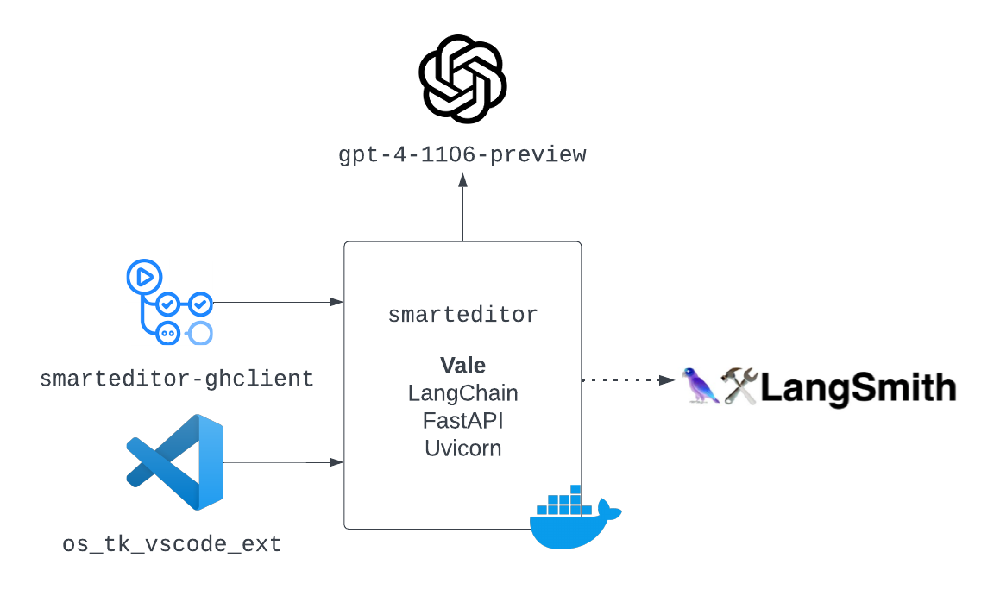

# smarteditor

 [](https://sonarcloud.io/summary/new_code?id=jonathanalgar_activator) [](https://sonarcloud.io/summary/new_code?id=jonathanalgar_activator) [](https://makeapullrequest.com)  [](https://makeapullrequest.com)

## Overview

[](https://jonathanalgar.github.io/slides/Using%20AI%20and%20LLMs%20in%20docs-as-code%20pipelines.pdf)

Service to batch transform sentences using Vale output as input to an LLM (currently `gpt-4-1106-preview`).

Exists to abstract interaction with the LLM and LangSmith APIs and provide a single interface for clients, for example [smarteditor-ghclient](https://github.com/jonathanalgar/smarteditor-ghclient).

See OpenAPI specification for the service [here](https://app.swaggerhub.com/apis/JONATHANALGARGITHUB/smarteditor/0.1).

## Usage

1. Clone the repo.
1. Copy `.env-example` to `.env` and fill in the required env variables.
1. Copy `.vale.ini-example` to `.vale.ini` add styles as required. Vale styles are located in the styles folder and require a `description` field. You can add a `link` field if you want to link out to the rule. To use `smarteditor` as `activator`, just use the one style:

    ```bash
    [*.*]
    Microsoft.Passive = warning
    ```

1. Optionally edit `config.json` to customize CORS and logging.
1. Run `docker-compose up` (v1) or `docker compose up` (v2) to build and start the service.
1. Run `python client-example.py example/how_to_work_with_large_language_models.md` to test. Expected output:

    ```
    $ python client-example.py example/how_to_work_with_large_language_models.md
    INFO [25-02-2024 06:38:17] File read successfully.
    INFO [25-02-2024 06:38:17] Payload:
    INFO [25-02-2024 06:38:17] {
    "text": "# How to work with large language models..."
    }
    INFO [25-02-2024 06:38:17] Sending payload...
    INFO [25-02-2024 06:38:39] Response received at 25-02-2024 06:38:39
    {"violations":[{"original_sentence":"The magic of large language models is that by being trained to minimize this prediction error over vast quantities of text, the models end up learning concepts useful for these predictions.","revised_sentence":"The magic of large language models lies in their training to minimize prediction error over vast quantities of text, which leads them to learn concepts useful for these predictions.","clear_explanation":"The revision changes the sentence to active voice by removing the passive construction 'by being trained' and replacing it with an active construction 'lies in their training'. Fixes: [Use the active voice.](https://github.com/OutSystems/docs-validation/blob/master/style-guide/content.adoc#use-the-active-voice)"},{"original_sentence":"Large language models can be prompted to produce output in a few ways:","revised_sentence":"You can prompt large language models to produce output in a few ways:","clear_explanation":"The revision changes the sentence to active voice by specifying the actor ('You') who can prompt the models, instead of the passive 'can be prompted'. Fixes: [Use the present tense whenever possible.](https://github.com/OutSystems/docs-validation/blob/master/style-guide/content.adoc#use-the-present-tense), [Use the active voice.](https://github.com/OutSystems/docs-validation/blob/master/style-guide/content.adoc#use-the-active-voice)"},{"original_sentence":"Write your instruction at the top of the prompt (or at the bottom, or both), and the model will do its best to follow the instruction and then stop.","revised_sentence":"Write your instruction at the top of the prompt (or at the bottom, or both), and the model does its best to follow the instruction and then stops.","clear_explanation":"The revision changes the sentence to present tense by replacing 'will do' with 'does' and 'will stop' with 'stops'. Fixes: [Use the present tense whenever possible.](https://github.com/OutSystems/docs-validation/blob/master/style-guide/content.adoc#use-the-present-tense)"},{"original_sentence":"To steer the model, try beginning a pattern or sentence that will be completed by the output you want to see.","revised_sentence":"To steer the model, begin a pattern or sentence that the output you want to see completes.","clear_explanation":"The revision changes the sentence to present tense and active voice by replacing 'try beginning' with 'begin' and rephrasing 'that will be completed by the output' to 'that the output completes'. Fixes: [Use the present tense whenever possible.](https://github.com/OutSystems/docs-validation/blob/master/style-guide/content.adoc#use-the-present-tense), [Use the active voice.](https://github.com/OutSystems/docs-validation/blob/master/style-guide/content.adoc#use-the-active-voice)"},{"original_sentence":"In addition, the models won't necessarily know where to stop, so you will often need stop sequences or post-processing to cut off text generated beyond the desired output.","revised_sentence":"In addition, the models don't necessarily know where to stop, so you often need stop sequences or post-processing to cut off text generated beyond the desired output.","clear_explanation":"The revision changes the sentence to present tense by replacing 'won't' with 'don't' and 'will often need' with 'often need'. Fixes: [Use the present tense whenever possible.](https://github.com/OutSystems/docs-validation/blob/master/style-guide/content.adoc#use-the-present-tense)"},{"original_sentence":"Instructions can be detailed, so don't be afraid to write a paragraph explicitly detailing the output you want, just stay aware of how many [tokens](https://help.openai.com/en/articles/4936856-what-are-tokens-and-how-to-count-them) the model can process.","revised_sentence":"You can detail instructions, so don't be afraid to write a paragraph that explicitly details the output you want, just stay aware of how many [tokens](https://help.openai.com/en/articles/4936856-what-are-tokens-and-how-to-count-them) the model can process.","clear_explanation":"The revision changes the sentence to active voice by rephrasing 'Instructions can be detailed' to 'You can detail instructions'. Fixes: [Use the active voice.](https://github.com/OutSystems/docs-validation/blob/master/style-guide/content.adoc#use-the-active-voice)"},{"original_sentence":"** Explicitly asking the model to produce high quality output or output as if it was written by an expert can induce the model to give higher quality answers that it thinks an expert would write.","revised_sentence":"** Explicitly asking the model to produce high quality output or output as if an expert wrote it can induce the model to give higher quality answers that it thinks an expert would write.","clear_explanation":"The revision changes the sentence to active voice by rephrasing 'as if it was written by an expert' to 'as if an expert wrote it'. Fixes: [Use the active voice.](https://github.com/OutSystems/docs-validation/blob/master/style-guide/content.adoc#use-the-active-voice)"},{"original_sentence":"This can be done by simply adding a line like \"[Let's think step by step](https://arxiv.org/abs/2205.11916)\" before each answer.","revised_sentence":"You can simply add a line like \"[Let's think step by step](https://arxiv.org/abs/2205.11916)\" before each answer to achieve this.","clear_explanation":"The revision changes the sentence to active voice by specifying the actor ('You') who can add the line, instead of the passive 'can be done'. Fixes: [Use the active voice.](https://github.com/OutSystems/docs-validation/blob/master/style-guide/content.adoc#use-the-active-voice)"}],"run_url":"https://smith.langchain.com/public/74ac02bf-2361-4f64-85a3-4bc05d75278a/r"}
    ```

1. This is a very basic client. Check [smarteditor-ghclient](https://github.com/jonathanalgar/smarteditor-ghclient) to integrate the service into your docs-as-code pipeline.

## Features

* Uses [LangChain's implementation of OpenAI function calling](https://python.langchain.com/docs/modules/model_io/output_parsers/types/pydantic) to reliably generate a JSON of expected format.
* Optionally integrates with LangSmith to serve [trace URL](https://api.python.langchain.com/en/latest/chains/langchain.chains.openai_functions.base.create_structured_output_chain.html#) for each generation.

## TODO

- [ ] Better error handling
- [ ] Unit tests
- [ ] Special handling for large files
- [ ] Rate limiting at the service level
- [ ] Explore extending to models beyond OpenAI
- [X] Option to use Azure OpenAI Services
