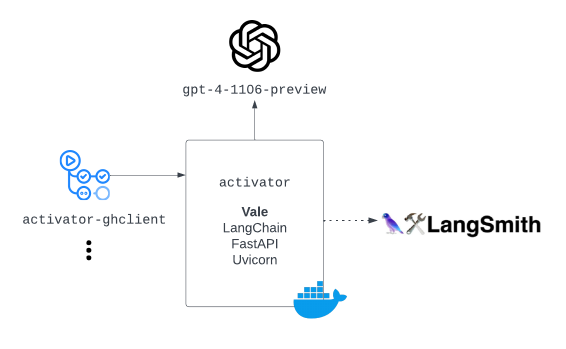

# activator


 [](https://makeapullrequest.com)

## Overview

[](https://jonathanalgar.github.io/slides/Using%20AI%20and%20LLMs%20in%20docs-as-code%20pipelines.pdf)

Service to batch transform sentences from passive voice to active voice using Vale (`styles/Microsoft/Passive.yml`) output as input to an LLM (currently `gpt-4-1106-preview`).

Exists to abstract interaction with the LLM and LangSmith APIs and provide a single interface for clients, for example [activator-ghclient](https://github.com/jonathanalgar/activator-ghclient).

See OpenAPI specification for the service [here](https://app.swaggerhub.com/apis/JONATHANALGARGITHUB/activator/0.1).

### Why?

via [developers.google.com:](https://developers.google.com/tech-writing/one/active-voice)

> Use the active voice most of the time. Use the passive voice sparingly. Active voice provides the following advantages:
> * Most readers mentally convert passive voice to active voice. Why subject your readers to extra processing time? By sticking to active voice, you enable readers to skip the preprocessor stage and go straight to compilation.
> * Passive voice obfuscates your ideas, turning sentences on their head. Passive voice reports action indirectly.
> * Some passive voice sentences omit an actor altogether, which forces the reader to guess the actor's identity.
> * Active voice is generally shorter than passive voice.

## Usage

1. Clone the repo.
1. Copy `.env-example` to `.env` and fill in the required env variables.
1. Optionally edit `config.json` to customize CORS and logging.
1. Run `docker-compose up` to build and start the service.
1. Run `python client-example.py example/apis.ipynb` to test. Expected output:

    ```bash
    $ python client-example.py example/how_to_work_with_large_language_models.md
    Enter endpoint URL (eg. https://activator-prod.westeurope.cloudapp.azure.com:9100/activator):
    Enter ACTIVATOR_TOKEN:
    INFO [17-01-2024 09:42:37] File read successfully.
    INFO [17-01-2024 09:42:37] Payload:
    INFO [17-01-2024 09:42:37] {
    "text": "# How to work with large language models\n\n## How..."
    }
    INFO [17-01-2024 09:42:37] Sending payload...
    INFO [17-01-2024 09:43:13] Response received at 17-01-2024 09:43:13
    {"violations":[{"original_sentence":"The magic of large language models is that by being trained to minimize this prediction error over vast quantities of text, the models end up learning concepts useful for these predictions.","revised_sentence":"The magic of large language models lies in their training to minimize prediction error over vast quantities of text, which leads them to learn concepts useful for these predictions.","clear_explanation":"The subject 'their training' is chosen to emphasize the action of training the models, which is the main focus of the sentence."},{"original_sentence":"Large language models can be prompted to produce output in a few ways:","revised_sentence":"You can prompt large language models to produce output in a few ways:","clear_explanation":"The subject 'You' is chosen to directly address the reader, indicating who can perform the action of prompting the models."},{"original_sentence":"An example of each is shown below.","revised_sentence":"The article shows an example of each below.","clear_explanation":"The subject 'The article' is chosen to indicate that the article itself provides the examples."},{"original_sentence":"Instructions can be detailed, so don't be afraid to write a paragraph explicitly detailing the output you want, just stay aware of how many [tokens](https://help.openai.com/en/articles/4936856-what-are-tokens-and-how-to-count-them) the model can process.","revised_sentence":"You can write detailed instructions, so don't be afraid to write a paragraph explicitly detailing the output you want, just stay aware of how many [tokens](https://help.openai.com/en/articles/4936856-what-are-tokens-and-how-to-count-them) the model can process.","clear_explanation":"The subject 'You' is chosen to directly instruct the reader on how to write instructions for the model."},{"original_sentence":"To steer the model, try beginning a pattern or sentence that will be completed by the output you want to see.","revised_sentence":"To steer the model, begin a pattern or sentence that you want the model to complete with the desired output.","clear_explanation":"The subject 'you' is chosen to directly instruct the reader on how to guide the model's output."},{"original_sentence":"** Explicitly asking the model to produce high quality output or output as if it was written by an expert can induce the model to give higher quality answers that it thinks an expert would write.","revised_sentence":"** When you explicitly ask the model to produce high quality output or output as if an expert wrote it, you can induce the model to give higher quality answers that it thinks an expert would write.","clear_explanation":"The subject 'you' is chosen to directly instruct the reader on how to elicit higher quality answers from the model."},{"original_sentence":"This can be done by simply adding a line like \"[Let's think step by step](https://arxiv.org/abs/2205.11916)\" before each answer.","revised_sentence":"You can achieve this by simply adding a line like \"[Let's think step by step](https://arxiv.org/abs/2205.11916)\" before each answer.","clear_explanation":"The subject 'You' is chosen to directly instruct the reader on the method to prompt the model for detailed reasoning."}],"run_url":"https://smith.langchain.com/public/7250f065-cf16-4e7b-8b1e-fe03004fb949/r"}
    ```

1. This is a very basic client. Check [activator-ghclient](https://github.com/jonathanalgar/alttexter-ghclient) to integrate the service into your docs-as-code pipeline.

## Features

* Uses [LangChain's implementation of OpenAI function calling](https://python.langchain.com/docs/modules/model_io/output_parsers/types/pydantic) to reliably generate a JSON of expected format.
* Optionally integrates with LangSmith (in beta) to serve [trace URL](https://api.python.langchain.com/en/latest/chains/langchain.chains.openai_functions.base.create_structured_output_chain.html#) for each generation.

## TODO

- [ ] Better error handling
- [ ] Unit tests
- [ ] Special handling for large files
- [ ] Rate limiting at the service level
- [ ] Option to use Azure OpenAI Services
- [ ] Explore extending to models beyond OpenAI
- [ ] Extend this TODO list